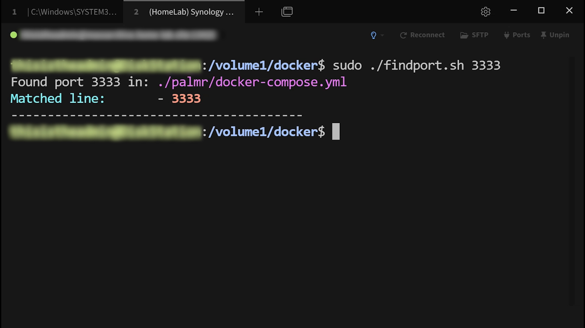

# 🔍 FindPort

A simple, fast script that searches through your Docker infrastructure and tells you exactly **which service** is using a given port (based on folder structure).

Built for homelab admins with dozens (or hundreds) of self-hosted services, FindPort makes it easy to resolve mystery ports and maintain Docker hygiene.

---

## Why I Built This

In my homelab, I run over 125 Docker containers using a standardized structure:  
Each service has its own directory (e.g. `/volume1/docker/immich/`, `/volume1/docker/uptime-kuma/`, `/volume1/docker/jellystat/`) containing a `docker-compose.yml` file and all persistent data. This setup makes backups and versioning clean and simple.

However, when I forget to document a port assignment, I sometimes run into "mystery ports" during scans with [PortNote](https://github.com/crocofied/PortNote)—a great tool for visualizing port usage. That’s when I needed a way to answer the dreaded question:

> **“Wait… what’s running on port 3333?”**

---

## 📸 Screenshot



> *See the writeup and video tour on my website:*  
> [https://jacques.home-lab.site](https://jacques.home-lab.site/wait-whats-on-port-3333)

---

## 🛠 How It Works

FindPort scans a directory tree (like `/volume1/docker`) for `docker-compose.yml` files.  
It searches for the given port number and, when found, returns the name of the parent directory—i.e. the service name.

Since I follow the convention of naming each directory after the service it runs, this script gives me the exact answer I need with zero guesswork.

---

## 📂 Directory Structure Assumed

```bash
/docker
├── immich/
│   └── docker-compose.yml
├── vikunja/
│   └── docker-compose.yml
├── jellystat/
│   └── docker-compose.yml
```

Each directory holds:
    A single service
    A docker-compose.yml
    All persistent volumes/data

## 🧰 Usage

1. Clone or download this repo.
2. Give the script the appropriate permissions

   `sudo chmod +x findport.sh`
   
4. Run the script and pass it an unknown port as your argument:
  
   `./findport.sh 3333`

---

## ✅ Requirements

Standard GNU tools:
- grep
- awk
- find 

**NOTE:** Tested on Linux (Debian/Ubuntu) and Synology DSM with Docker installed.

---

## 🙌 Thanks

Shoutout to PortNote for being a fantastic port documentation tool and the inspiration for this script.
